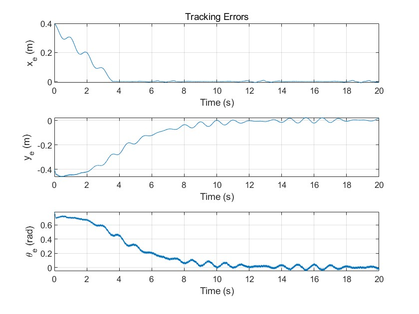
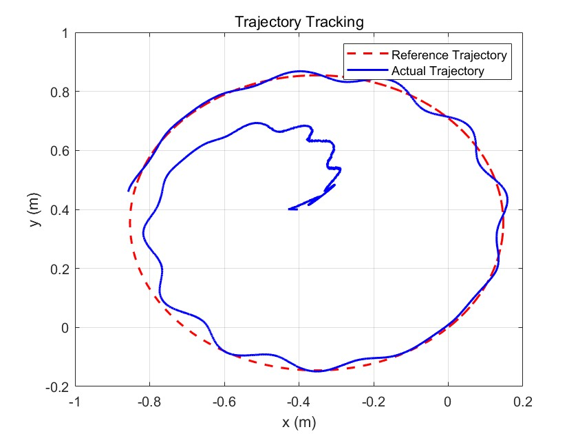

# Original paper

This team-work is inspired from the article: [Nonlinear Sliding Mode Control of a Two-Wheeled Mobile](https://discovery.ucl.ac.uk/id/eprint/1551571/1/Spurgeon_authorFinalVersion.pdf)

# Work Description

Team members: Yihao Liao & Yiren Qiu & Ghous Iqbal
We primarily reproduced the "Control Design of WMR" section from the paper, utilizing MATLAB for the control design of a two-wheeled mobile robot (WMR) system. A sliding surface was designed for the system, and its stability was analyzed. The tracking problem under reference trajectory constraints was considered, and it was proven that the stability of the sliding mode is asymptotically stable. Additionally, the reachability of the sliding mode was demonstrated.

# Details Explanation

## Model initialization

```
r = 0.0315; % Wheel radius
R = 0.09; % Distance between two wheels
c1 = 0.6; % Sliding surface parameter
eta1 = 1.2; % Reaching gain for sigma1
eta2 = 0.1; % Reaching gain for sigma2

```

$$
\left[\begin{array}{c}
v \\
\omega
\end{array}\right]=\left[\begin{array}{cc}
\frac{r}{2} & \frac{r}{2} \\
\frac{r}{R} & -\frac{r}{R}
\end{array}\right]\left[\begin{array}{l}
\omega_R \\
\omega_L
\end{array}\right] 
$$

## Error analysis

```
xe = (qr(1) - q(1)) * cos(q(3)) + (qr(2) - q(2)) * sin(q(3));
ye = -(qr(1) - q(1)) * sin(q(3)) + (qr(2) - q(2)) * cos(q(3));
theta_e = qr(3) - q(3);
qe = [xe; ye; theta_e];

```


## Nonlinear silding mode control method

Define the input $u, η1,η2$ are positive reaching gains, $J_n$ is the Jacobian Matrix of the sliding functions.

```
    sigma1 = c1 * theta_e + atan(ye);
    sigma2 = xe;
    Jn = [0, 1/(1 + ye^2), 0; 1, 0, 0];
    E = [0, -(c1 + xe/(1 + ye^2)); -1, ye];
    u = -inv(E) * (Jn * [vr_ref * cos(theta_e);vr_ref * sin(theta_e);wr_ref] + [eta1 * sign(sigma1); eta2 * sign(sigma2)]);
    v = u(1);
    w = u(2);
```


## State update

Inside the loop, the state of the robot will be updated by the following code, adding the influence of the disturbance.

```
    disturbance = 0.001 * sin(2 * pi * t);
```
```
    q_dot = [v * cos(q(3)); v * sin(q(3)); w];
    disturbance_array = [disturbance(k);disturbance(k);disturbance(k)];
    q = q + q_dot * dt+ disturbance_array;
```


# Experiment
The main simulation results with a circle reference trajectory with initial condition $q_r(0, 0, π4 )$, reference control pair $v_r = 0.25, ω_r = 0.5$ and initial posture of the actual robot $q(−0.4, 0.4, 0)$ are shown in below figures.







